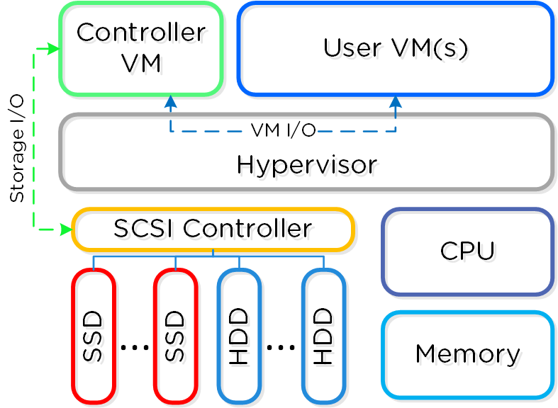

### Proposal for a Thesis in the Field of Information Technology
#### For Partial Fulfillment of Requirements For a Master of Liberal Arts Degree

#### Harvard University Extension School
#### Submission Date

#### Cyril Allen
500 N. Duke St.

Apt. 55-305

Durham, NC 27701

[cyril0allen@gmail.com](mailto:cyril0allen@gmail.com)

Abstract
--------

TODO

Introduction
------------

TODO

### Nutanix

Nutanix is a software company headquartered in San Jose, CA. The bundled
hardware/software solution sold by Nutanix consists of at least 3 servers that
run an industry standard hypervisor (VMware ESXi, Microsoft Hyper-V, or Linux
KVM).  Storage I/O for the guests hosted on the hypervisor is sent to the
Nutanix Controller VM (CVM) to be serviced [1]. The figure below shows what a
single node in a Nutanix cluster logically looks like:



The CVM is networked together with the CVMs from other servers and creates a
distributed system that manages all storage resources. Each CVM exports block
devices that appear as disks to the guest VMs that utilize the NDFS. All data
that is written to the block device presented by Nutanix is replicated across 2
nodes for a replication factor (RF) 2 configuration and 3 nodes for a RF3
configuration.

#### The Nutanix CVM

The CVM runs a CentOS 6.5 operating system and the services it provides are
accessed by the hypervisor remotely via NFS, SMB, or iSCSI for the ESXi,
Hyper-V, or KVM hypervisors respectively. The process that provides the
interface to the hypervisors to enable I/O service is known as the Stargate
process.

#### Stargate

Stargate is responsible for all data management and I/O operations and is the
only process on the CVM that directly manipulates data on disk. The Stargate
process is comprised of several components, but the ones relevant for this
proposal are the Oplog and the Extent Store. The Oplog acts as a write buffer
to absorb random I/O and the Extent Store can be thought of as the persistent
data storage. This document proposes a project that directly deals with the
Oplog, so in the next section we'll dive deeper into that component.

##### The Oplog

The Oplog is a persistent write buffer for Stargate and serves to decrease write
latency by absorbing bursts of random writes. All writes that are absorbed by
the Oplog are written directly to SSD and synchronously replicated to other CVMs
in the cluster to satisfy the replication factor requirements as configured by
the NDFS user before the write is acknowledged. These writes are also coalesced
if possible, further increasing performance by reducing CPU utilization of
handling multiple nearby writes.

Data in Oplog is "drained" to the Extent store in the background to make room
for more random writes. For sequential workloads, the Oplog is bypassed and the
writes go straight into the Extent Store. All reads that need data residing
in the Oplog will have that data serviced directly by the Oplog until it drains.

##### The Extent Store

TODO

#### The Current State of Replica Selection

TODO: Explain rack awareness

### Nutanix Cluster Hardware Configurations

TODO: Describe RUs, nodes, networking, and anything else infrastructure-wise

### The Current issues with Heterogeneous Clusters

TODO: 
-- Inconsistent space utilization on nodes.
-- Overburdening small nodes via replica traffic

Project: Adaptive Replica Selection
-------------------

To remedy the problems that arise from hetereogeneous cluster configurations
discussed in the previous section, I plan to implement an adaptive replica
selection algorithm. This algorithm uses a "fitness value" that is calculated
from various statistics available for each disk such as disk fullness, latency,
business, etc. These fitness values are to be used as a ranking mechanism when
selecting where the Stargate will place data. This should result the prevention
of many of the issues discussed in the introduction.

### Fitness Score Calculation

Currently, each Stargate keeps track of a large number of statistics for its
local disks. For the explanation in this proposal, suppose there are only the
following stats exposed:

* Disk utilization in bytes (used to calculate fullness percentage)
* Disk busy percentage
* Average latency

This data will be used to calculate a single value for each disk in the cluster
via a formula similar to:

```
fitness_value = k1 * (1 - disk_fullness_pct) +
                k2 * (100 - disk_busy_pct) +
                k3 * (5000 - min(avg_latency_usec, 5000))
```

The `kn` values above are weights assigned to each stat that will be mutable at
runtime (via Google Gflags).

#### Fitness Score Hierarchies

One potential area of investigation will be a fitness score hierarchy based on
rackable units, which encompass nodes, which encompass disks. There are obvious
benefits to this approach since it allows for a searching pattern such as:

```
for rack in rackable_unit_list:
  for node in rack.nodes():
    for disk in node.disks():
      # do things
```

The above seems much more efficient when compared to iteration through every
disk in the cluster, since we would be able to eliminate entire racks worth of
disks at a time in a rack-aware cluster configuration and entire nodes worth of
disks at a time in any cluster configuration.

Both approaches will need to be implemented, benchmarked, and have their
resulting replica placements analyzed.

##### Node Fitness

For nodes, we can calculate a fitness value using the stats we find for each
disk. Relevant values to calculate would be:

* Total fullness percentage
* SSD tier fullness percentage
* HDD tier fullness percentage
* Median disk fitness value
* Degraded state

These stats can be calculated in the first pass through all disks.

##### Rackable Unit Fitness

For RUs, we can calculate a fitness value using the stats we find for each
node. Relvant values to calculate would be:

* Average node fullness percentage
* Median node fitness value

These stats must be calculated in a pass through the set of nodes in the cluster.

### Ranking Algorithm

The fitness values assigned to each disk, node, and RU are used to rank the
desirability of the disks contained within. The most straight-forward way to do
this is via a priority queue data structure. To do this, I will implement a
custom data structure to automatically store and rank arbitrary objects.

#### The ReplicaQueue Class

The ReplicaQueue (RQ) class will be used to store, rank, and gather samples of
arbitrary-typed objects. Upon instantiation of a RQ storing objects of some
type T, one must provide a ranking function that takes a single argument of
type T and returns a fitness value in the form of a double.

Upon insertion into the RQ, the fitness function will be applied to the object
inserted and they will be placed in an internal data structure. At the heart of
this RQ will be a standard c++11 STL priority queue that will hold an ordered
pair of type `std::pair<double fitness_value, T obj>`. This forces the STL
priority queue to rank the items inserted by the calculated fitness value and
in the case of a tie, use the `<` operator for type T.

The ReplicaQueue will have the following interface:

##### void Emplace(T element)
Construct and insert an element into the queue. Upon insertion, the fitness
function will be applied to the element and the value will be the first item in
a pair stored in a standard STL priority queue.

##### T Top()
Access the highest ranked element in the queue.

##### bool Empty()
Returns true if queue is empty, false otherwise.

##### void Clear()
Clear the RQ and all internal state.

##### shared_ptr<std::vector<T>> WeightedSample(int num_items)
This will return a shared pointer to an STL vector of `num_items` objects
inside the RQ. The ordering of the objects is such that the high fitness
objects have a high probability of being towards the beginning of the vector.

The motivation for this probabilistic approach is describedin the next section.

#### Weighted Shuffling

One problem that arises when ranking disks based on their fitness value is that
we must evaluate candidates in order from highest rank to lowest. In doing so,
we put the disk with the highest fitness value and the node that hosts it at
risk of being encumbered by replica traffic. To mitigate this, we must select
disks probabilistically via WeightedSample(). Sampling in this manner allows us
to periodically reshuffle the disk candidate vectors used in replica selection
and lower the chances of over-burdening the high fitness disks.

Shuffling of the candidate disk vectors will occur when there is a
configuration change in the cluster caused by any one of:

* Node addition/removal
* Disk failures
* A configurable timer-tick

This will allow us to keep the candidate disk vectors in sync with each other
and periodically update the disk stats as I/O is sent to disks.

TODO: Providing access to the weight vector from ReplicaQueue to do individual sampling in O(N).

### Polling for Remote Disk Stats

Local Stargates will have up-to-date statistics on the disks they are
responsible for, but they do not know the states of the disks belonging to
remote nodes. To get this information, communication must occur with the
Cassandra database that holds the NDFS metadata/stats.

This proposed replica selection technique will need to update the disk
statistics every time cluster state changes (node/disk insertion and/or
removal) and within regular time intervals so that the stats do not become
stale.

### ReplicaSelector Changes

Currently, the ReplicaSelector class maintains a vector of candidate disks for
each storage tier. When selecting a candidate, a disk is chosen randomly from
this vector and a determination is made as to whether this is a desirable disk.
For the proposed changes to take effect, we will need to modify this behavior
to either sequentially search through a vector sampled from a ReplicaQueue for
each tier or to perform a weighted lottery selection from a disk vector sorted
by fitness value.

Testing and Benchmarks
----------------------

### Unit Testing Replica Selection via Simulation

TODO: Explain the current unit tests and various scenarios.

### Testing Replica Selection via Synthetic Workload Generation

TODO: Explain that we have X-ray and we want to compare the results.

Related Work
------------

TODO

Hardware Requirements
---------------------

The replica selection algorithms proposed in this paper can be tested and
verified using an exhaustive battery of software tests. However, we still
require real hardware for the performance testing of synthetic workloads in
heterogeneous clusters. If we are to verify that the proposed algorithm will
not introduce a performance regression in existing configurations that are
deemed satisfactory and also improve performance in current troublesome
scenarios, we will need to recreate the hardware configurations.

The hardware required for each problem is shown the table below:

| Problem to Test | Hardware Configuration |
| ------------- |:-------------:|
| Rack awareness' influence on replica selection | A rack-aware configuration. Not just a single node per RU, but also scenarios with 2 loaded chassis and a single node in the third chassis. |
| Avoidance of over-burdened nodes | Two high disk/CPU capacity nodes and a single low disk/CPU capacity node. |
| Testing Scalability | 16+ heterogeneous node cluster |

Software Requirements
---------------------

All software requirements are taken care of in my Nutanix development
environment. This includes:

* The unit test infrastructure for replica selection simulations.
* fio and Nutanix X-ray (workload generation tool) for benchmarking and usage of real disk stats.

Benchmarks and Performance Analysis Methodology
-----------------------------------------------

TODO

Preliminary Schedule
--------------------
| Task          | Time in Weeks |
| ------------- |:-------------:|
| TODO 1        | 1 week        |
| TODO 2        | 2 weeks       |
| TODO 3        | 3 weeks       |

Bibliography
------------
 TODO: format the ciations correctly

1. Poitras, S. (2015, November 11). The Nutanix Bible - NutanixBible.com.
Retrieved February 15, 2016, from http://nutanixbible.com/

2.  Lakshman, A., & Malik, P. (2008, August 25). Cassandra – A structured storage system on a P2P Network. Retrieved February 15, 2016, from https://www.facebook.com/notes/facebook-engineering/cassandra-a-structured-storage-system-on-a-p2p-network/24413138919/

Glossary
--------

* **ESXi** - The hypervisor created by VMware.

* **Extent Store** - Persistent storage for the NDFS.

* **Guest VM** - A virtual machine hosted on a hypervisor that is serviced by
  the CVM.

* **Hyper-V**

* **Hypervisor**

* **iSCSI**

* **KVM**

* **NFS**

* **Oplog** - Persistent write buffer that is part of Stargate.

* **RF** - Replication factor. If the cluster is configured as RF(N), there are
  N copies of all pieces of data distributed across N nodes.

* **RPC** - Remote Process Call

* **SMB**

* **VM** - Virtual Machine

Appendix
--------

TODO

[//]: # (Markdown cheatsheet: https://github.com/adam-p/markdown-here/wiki/Markdown-Cheatsheet)

